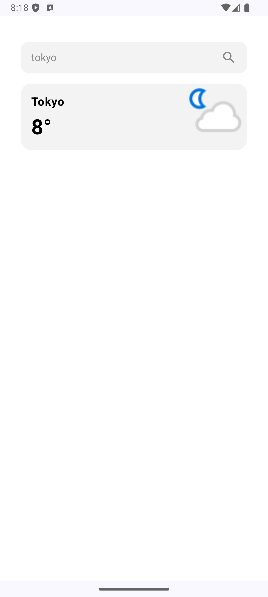

# WEATHER-TRACKER 📝

This is Weather Tracking app built with Jetpack Compose UI Toolkit.

## Built With 🛠

- **Kotlin**: First-class and official programming language for Android development.
- **Coroutines**: Asynchronous programming for efficient handling of background tasks.
- **Jetpack Compose UI Toolkit**: Modern UI development toolkit for building native Android UIs.
- **Android Architecture Components**:
    - **ViewModel**: Stores UI-related data that isn't destroyed on UI changes.
    - **Retrofit**: Networking Library for Android, To handle network requests and responses.
    - **DataStore**: DataStore for efficient and secure key-value and typed data storage, ensuring seamless state persistence across app launches.
- **StateFlow**: Flow APIs for emitting state updates and values to multiple consumers.
- **Dependency Injection**:
    - **Hilt-Dagger**: Standard dependency injection for Android applications.
    - **Hilt-ViewModel**: Dependency injection for ViewModel.
- **Material Components for Android**: Modular and customizable UI components following Material Design guidelines.
- **Moshi**: A modern JSON library for Android and Java, used for parsing JSON into Java/Kotlin objects and serializing Java/Kotlin objects into JSON.

## Architecture 👷‍♂️

This App follows combination of  MVVM (Model-View-ViewModel) architecture and Clean Architecture pattern, providing a robust and maintainable structure for the app.

## Screenshots

| Screenshot 1                    | Screenshot 2                    | Screenshot 3            |
|---------------------------------|---------------------------------|-------------------------|
|          |          |  |
| Screenshot 4                    | Screenshot 5                    |                         |
|  |  | 

